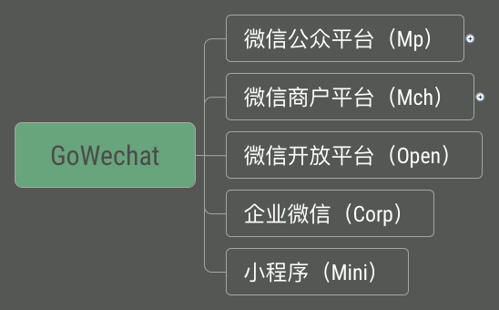
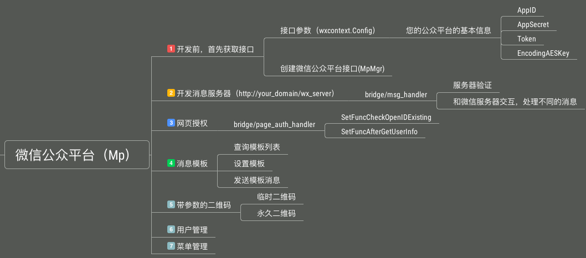
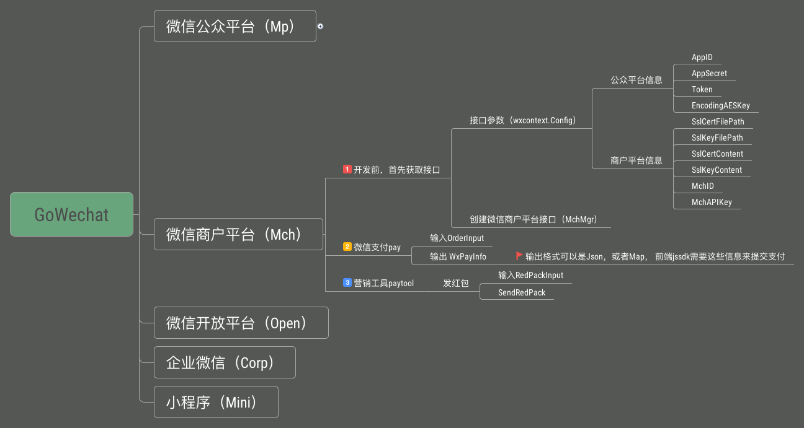

= GoWechat使用文档
:toc: left
//:icons: font

== 零、使用前阅读

=== 综述


项目目标：构建一套最简单易用的微信各大平台通用golang API

适用范围：可以与各种平台无缝整合，beego, gin, http （example目录提供完整的使用例子）

开源地址：[Github地址](https://github.com/yaotian/gowechat)

GoDoc: [GoDoc地址](https://godoc.org/github.com/yaotian/gowechat)

[[install,安装]]
=== 安装
  go get github.com/yaotian/gowechat

[[use,使用]]
=== 配置

==== 参数
```go
var config = wxcontext.Config{
  //微信公众平台，商户平台，需要填写的信息
	AppID:          "your app id",
	AppSecret:      "your app secret",
	Token:          "your token",
	EncodingAESKey: "your encoding aes key", 

	//以下是 mch商户平台需要的变量
	SslCertFilePath string //证书公钥文件的路径
	SslKeyFilePath  string //证书私钥文件的路径
	SslCertContent  string //公钥证书的内容
	SslKeyContent   string //私钥证书的内容
	MchID           string //商户ID
	MchAPIKey       string //商户平台设置的api key
}

```

=== 微信平台的操作接口


==== 微信公众平台

```go
wc := gowechat.NewWechat(config)
//微信公众平台
mp, err := wc.MpMgr()
if err != nil {
  return
}
```

==== 微信商户平台

```go
wc := gowechat.NewWechat(config)
//微信商户平台
mch , err := wc.MchMgr()
if err != nil {
  return
}

```

=== 在框架中使用

==== beego中使用的例子
  ./examples/beego 

==== gin中使用的例子
  ./examples/gin

==== net/http中使用的例子 
  ./examples/http

[[mp,mp]]
== 一、微信公众平台

=== 概述 



=== 1.获取接口

[source,go]
----
var config = wxcontext.Config{
  //微信公众平台，商户平台，需要填写的信息
	AppID:          "your app id",
	AppSecret:      "your app secret",
	Token:          "your token",
	EncodingAESKey: "your encoding aes key", 
}

wc := gowechat.NewWechat(config)
//微信公众平台
mp, err := wc.MpMgr()
if err != nil {
  return
}
----


=== 2.开发消息服务器
将开发的消息服务器（http://your_domain/wx_server）接入到微信公众平台，有几个步骤

1. 接入你的消息服务器时，微信公众号后台，会发信息给你的服务器，来进行验证。所以你的服务器需要知道如何处理验证消息。    
2. 微信公众平台与你的消息服务器之间通过消息通信来进行同步合作。所以你的消息服务器需要知道如何处理消息与如何发送消息。

本接口将复杂的过程（加密，打包，验证等等）封装了，让你只需要关心业务环节。

将以下的代码，加入到你的controller中，接口自动完成上面所说的两个功能，

[IMPORTANT]
你的controller需要能接收GET与POST两种消息

[source,go]
----
wc := gowechat.NewWechat(config)
//微信公众平台
mp, err := wc.MpMgr()
if err != nil {
  return
}

// 传入request和responseWriter
msgHandler := mp.GetMsgHandler(c.Ctx.Request, c.Ctx.ResponseWriter)

//设置接收消息的处理方法
msgHandler.SetHandleMessageFunc(func(msg message.MixMessage) *message.Reply {
  switch msg.Event {
  case message.EventSubscribe:
    return c.handleSubscribe(&msg)
  case message.EventScan:
    return c.handleScan(&msg)
  case message.EventUnsubscribe:
    return c.handleUnsubscribe(&msg)
  case message.EventClick:
    return c.handleClick(&msg)
  case message.EventLocation:
    return c.handleLocation(&msg)
  }

  switch msg.MsgType {
  case message.MsgTypeText:
    //回复消息：演示回复用户发送的消息
    text := message.NewText(msg.Content)
    return &message.Reply{message.MsgTypeText, text}
  case message.MsgTypeImage:
    return c.handleImage(&msg)
  }

	//处理消息接收以及回复
	err = msgHandler.Handle()
	if err != nil {
		beego.Error(err)
	}

})

----

==== 消息类型
消息分为以下几种：文本、图片、视频、声音、链接、坐标、图文、文章。

===== 文本消息
[source,go]
----
//回复消息：演示回复用户发送的消息
text := message.NewText("your message want to be sent")
return &message.Reply{message.MsgTypeText, text}
----

===== 图片消息
[source,go]
----
pic := message.NewImage("your_pic_mediaID")
return &message.Reply{message.MsgTypeImage, pic}
----

===== 视频消息
[source,go]
----
video := message.NewVideo("your_mediaID", "your_title", "your_description")
return &message.Reply{message.MsgTypeVideo, video}
----

===== 声音消息
[source,go]
----
voice := message.NewVoice("your_mediaID")
return &message.Reply{message.MsgTypeVoice, voice}
----

===== 链接消息
NOTE: 微信目前不支持回复链接消息

===== 坐标消息
NOTE: 微信目前不支持坐标消息

===== 图文消息
[source,go]
----
news := message.NewNews([]*Article{message.NewArticle("your_title", "your_description", "your_picURL", "your_url")})
return &message.Reply{message.MsgTypeNews, news}
----


=== 3.网页授权

[source,go]
----
wc := gowechat.NewWechat(config)
//微信公众平台
mp, err := wc.MpMgr()
if err != nil {
  return
}

oauthHandler := mp.GetPageOAuthHandler(c.Ctx.Request, c.Ctx.ResponseWriter, "http://your_domain/wxoauth")

oauthHandler.SetFuncCheckOpenIDExisting(func(openID string) (existing bool, stopNow bool) {
  //看自己的系统中是否已经存在此openID的用户
  //如果已经存在， 调用自己的Login 方法，设置cookie等，return true
  //如果还不存在，return false, handler会自动去取用户信息
  //your code
  return
})

oauthHandler.SetFuncAfterGetUserInfo(func(user user.Info) (stopNow bool) {
  //已获得用户信息，这里用信息做注册使用
  //调用自己的Login方法，设置cookie等
  //your code
})

oauthHandler.Handle()

----


=== 4.模板消息

[source,go]
----
wc := gowechat.NewWechat(config)
//微信公众平台
mp, err := wc.MpMgr()
if err != nil {
  return
}
api := mp.GetTemplate()

tmplMsg := new(template.Message)
tmplMsg.URL = your_url
tmplMsg.ToUser = your_to_user_openID
tmplMsg.TemplateID = your_templateID
tmplMsg.Data = makeMsgMessageData("your_first", "your_subject", "your_sender_name", "your_msg_content")
_, err = api.Send(tmplMsg)

func makeMsgMessageData(first, subject, sender, remark string) (data map[string]*template.DataItem) {
	data = make(map[string]*template.DataItem)
	data["first"] = &template.DataItem{Value: first, Color: "#173177"}
	data["keyword1"] = &template.DataItem{Value: sender, Color: "#173177"}
	data["keyword2"] = &template.DataItem{Value: subject, Color: "#173177"}
	remark = remark + "\n如果您不想收到此通知，请点击后->[消息]->右上角的设置按钮"
	data["remark"] = &template.DataItem{Value: remark, Color: "#2eb3ff"}
	return
}


----

=== 5.二维码

支持

* 临时二维码
* 永久二维码

输入参数支持 string， int


[source,go]
----
wc := gowechat.NewWechat(config)
//微信公众平台
mp, err := wc.MpMgr()
if err != nil {
  return
}

qrResult, err := mp.GetQrcode().CreateTemporaryQRCodeWithSceneString("your_scene_string", 60)
if err != nil {
  return
}

qrImageURL := qrResult.ImageURL()

----

=== 6.用户

[source,go]
----
wc := gowechat.NewWechat(config)
//微信公众平台
mp, err := wc.MpMgr()
if err != nil {
  return
}

var userInfo = new(user.Info)
userInfo, err = mp.GetUser().GetUserInfo("your_openID")
if err != nil {
  return
}

----

=== 7.菜单

[source,go]
----
wc := gowechat.NewWechat(config)
//微信公众平台
mp, err := wc.MpMgr()
if err != nil {
  return
}

var btnMenus []*menu.Button

btn = new(menu.Button)
btn.Name = m.Name
btn.SetViewButton("your_name", "your_url") //url menu

btnMenus = append(btnMenus,btn)

mp.GetMenu().SetMenu(btnMenus)

----


[[mch,mch]]
== 二、商户平台（微信支付）

=== 概述




=== 1.获取接口

[source,go]
----
var config = wxcontext.Config{
  //微信公众平台，商户平台，需要填写的信息
	AppID:          "your app id",
	AppSecret:      "your app secret",
	Token:          "your token",
	EncodingAESKey: "your encoding aes key", 

  //------以下是 mch商户平台需要的变量
  //
  //证书公钥，路径，内容要保证只要有一项设置
	SslCertFilePath: "your cert file path" //证书公钥文件的路径
	SslCertContent:  "your cert content" //公钥证书的内容

  //私钥，路径，内容要保证只要有一项设置
	SslKeyFilePath:  "your key file path" //证书私钥文件的路径
	SslKeyContent:   "your key content" //私钥证书的内容

	MchID: "your mch ID"           //商户ID
	MchAPIKey: "your mch API Key"  //商户平台设置的api key
  //------ End 商户平台设置
}

wc := gowechat.NewWechat(config)
//微信商户平台
mch , err := wc.MchMgr()
if err != nil {
  return
}
----


=== 2.支付订单
[source,golang]
----
var order = pay.OrderInput {
	OpenID: "your openID", //trade_type=JSAPI时（即公众号支付），此参数必传，此参数为微信用户在商户对应appid下的唯一标识
	Body: "购物支付",       //String(128)
	OutTradeNum: "your trade num", //String(32) 20150806125346 商户系统内部订单号，要求32个字符内，只能是数字、大小写字母_-|*@ ，且在同一个商户号下唯一。
	TotalFee: your_pay_number,     //分为单位
	IP: "your_ip",
	NotifyURL:  "your_notify_URL", //异步接收微信支付结果通知的回调地址，通知url必须为外网可访问的url，不能携带参数
	ProductID:""    //trade_type=NATIVE时（即扫码支付），此参数必传

	tradeType: "JSAPI" //JSAPI，NATIVE，APP
}
----

公众号支付 H5中调用jssdk支付：
[source,go]
----
//公众号支付（jssdk支付数据）
cfg, err := mch.GetPay().GetJsAPIConfig(order)
----

扫码支付：
[source,go]
----
qrcodeImageURL, err := mch.GetPay().GetNativePayQrcodePicURL(order)
----

=== 3.为两种支付方式生成JS配置

==== a.WeixinJSBridge:
支付数据，json格式，这些数据可以传递到前端模板中使用
[source,go]
----
//公众号支付（jssdk支付数据）
cfg, err := mch.GetPay().GetJsAPIConfig(order)
json := cfg.ToJSON()
----

前端的JS代码例子
[source,javascript]
----
...
WeixinJSBridge.invoke(
       'getBrandWCPayRequest', {{$json}},
       function(res){
           if(res.err_msg == "get_brand_wcpay_request:ok" ) {
                // 使用以上方式判断前端返回,微信团队郑重提示：
                // res.err_msg将在用户支付成功后返回
                // ok，但并不保证它绝对可靠。
           }
       }
   );
...
----

==== b.JSSDK:
支付数据，map格式，这些数据可以传递到前端模板中使用
[source,go]
----
//公众号支付（jssdk支付数据）
cfg, err := mch.GetPay().GetJsAPIConfig(order)
mapData := cfg.ToMap()
----

前端的JS代码例子
[source,javascript]
----
wx.chooseWXPay({
    timestamp: {{$timestamp}},
    nonceStr: {{$nonceStr}},
    package: {{$package}},
    signType: {{$signType}},
    paySign: {{$paySign}}, // 支付签名
    success: function (res) {
        // 支付成功后的回调函数
    }
});
----

=== 4.支付通知
微信支付后，微信服务器会将支付结果回调到你的服务器，服务器地址是在订单参数中设置的NotifyURL,为了安全，过来的数据需要检验正确。
[source,go]
----
wc := gowechat.NewWechat(config)
//微信商户平台
mch , err := wc.MchMgr()
if err != nil {
  return
}

//回调的数据检查，例子
req := c.Ctx.Request
data, err := ioutil.ReadAll(req.Body)
if err != nil {
	return
}
isSuccess, err := mch.GetPay().CheckPayNotifyData(data)
if err != nil {
	return
}
//成功后，你自己的处理

----

=== 5.查询订单

该接口提供所有微信支付订单的查询，商户可以通过该接口主动查询订单状态，完成下一步的业务逻辑。

需要调用查询接口的情况：

* 当商户后台、网络、服务器等出现异常，商户系统最终未接收到支付通知；
* 调用支付接口后，返回系统错误或未知交易状态情况；
* 调用被扫支付API，返回USERPAYING的状态；
* 调用关单或撤销接口API之前，需确认支付状态；

=== 6.关闭订单

=== 7.退款

=== 8.账单

=== 9.发红包

前提条件：发红包前，你必须在商户平台中充值

[source,go]
----

var input paytool.RedPackInput
input.ToOpenID = "your openID"
input.MoneyFen = int(your_money * 100)
input.SendName = "your send Name"
input.ActName = "佣金提现"
input.Wishing = "您的分销佣金"
input.Remark = fmt.Sprintf("佣金提现 User:%s Weixin:%s", "your nickname", "your openID")
input.IP = "your IP"
input.SceneID = paytool.SceneIDAgentBonous

//商户平台接口
mch , err := wc.MchMgr()
if err != nil {
  return
}
_, err = mch.GetPayTool().SendRedPack(input)

----


[[open,open]]
== 三、开放平台

[[corp,corp]]
== 四、企业微信

[[mini,mini]]
== 五、小程序

[[code,code]]
== 六、谁正在使用

[果真免费微社区及推广平台](http://84u6.com)

[新课堂360教育云平台](http://xkt360.com)

如果您正在使用GoWechat，请在github内留言

== 七、微信官方文档参考

.Windtrainer workouts
[width="100%",cols="1,^4,10",options="header"]
|=========================================================
|目录  | 对应     |官方文档 

|/mp | 微信公众平台(订阅号，服务号)| [文档](https://mp.weixin.qq.com/wiki?t=resource/res_main&id=mp1445241432) 

|/mch | 微信商家平台  |  [文档](https://pay.weixin.qq.com/wiki/doc/api/index.html)

|/open| 微信开放平台|   [文档](https://open.weixin.qq.com/cgi-bin/showdocument?action=dir_list&t=resource/res_list&verify=1&lang=zh_CN) 

|/corp | 微信企业号  | [文档](http://qydev.weixin.qq.com/wiki/index.php?title=%E9%A6%96%E9%A1%B5) 

|=========================================================
